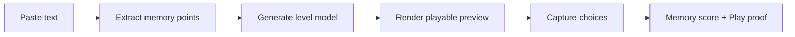

# 入境·GameCraft Research And Plan

## Current Product Shape

入境·GameCraft is a one-page Web demo that turns text into a playable game.

```text
Paste text -> Agent picks skeleton -> Play -> Memory proof
```

The Hackathon version should not split into a creator backend and player app. The same page contains the creator action, the Agent skeleton decision, the generated playable preview, and the proof state.

## Competitive Notes

### StudyQuest

- Source: https://www.studyquest.app/
- Useful pattern: uploaded study material becomes interactive study games.
- Why it matters: StudyQuest is the clearest category anchor for "notes/materials -> games".
- Difference for 入境·GameCraft:
  - StudyQuest is student/studying oriented.
  - 入境·GameCraft should be broader: SOPs, product explanations, training materials, activity rules, subtitles, and lessons.
  - 入境·GameCraft should emphasize proof: memory score, play events, and review evidence.
- Product decision: reference the "turn material into games" positioning, but do not copy the study-plan product shape.

### StudyQuest Study Plan

- Source: https://www.studyquest.app/study-plan
- Useful pattern: upload material, set a target date, receive a study plan.
- Product decision: not the primary 入境·GameCraft shape. Study planning can become a future post-proof feature, but the Hackathon demo should stay focused on playable memory generation.

### Nexus

- Sources:
  - https://devpost.com/software/nexus-lq9s4o
  - https://github.com/ArushNo1/Nexus
- Useful pattern: lesson material becomes interactive games and animated learning experiences.
- Why it is hard to find: "Nexus" is a generic name, and the visible footprint appears centered on Devpost/GitHub rather than Product Hunt or a public SaaS launch.
- Product decision:
  - Keep the lesson-to-game pipeline insight.
  - Avoid live arbitrary game-code generation during the demo.
  - Prefer stable playable templates driven by structured memory/level data.

### Creatium

- Sources:
  - https://www.creatium.com/product
  - https://www.producthunt.com/products/creatium
- Useful pattern: AI-powered interactive learning, roleplays, simulations, coaches, and gamified lessons.
- Product decision: useful for enterprise learning language, but 入境·GameCraft should feel more instantly playable and less like course authoring software.

### CustomerGlu

- Sources:
  - https://www.customerglu.com/
  - https://www.producthunt.com/products/customerglu
- Useful pattern: challenges, streaks, leaderboards, rewards, and campaign analytics.
- Product decision: useful later for retention loops and growth campaigns; not the core Hackathon page.

### Quiz/Flashcard Adjacent Products

Examples include Questgen, Quiz Wizard, Meiro, and other AI quiz generators.

- Useful pattern: quick content-to-question generation.
- Product decision: do not position 入境·GameCraft as another quiz generator. The differentiator is playable memory experience plus proof.

## Demo Scope

The 2-3 minute demo should prove:

1. A normal paragraph can become a playable memory level.
2. The generated level has a clear memory point, choice, feedback, and score.
3. The player interaction produces proof, not just a final score.
4. The experience is stable because the page renders a controlled playable template, not arbitrary generated game code.

## Architecture For The Hackathon Demo



## Current Implementation

- `src/App.tsx`: one-page Agent playable app with input, GameCraft route library, Phaser Boss gameplay, dnd-kit card stacking, and proof state.
- `src/App.css`: visual system, responsive layout, playable stage, game HUDs, and proof feed.
- `public/assets/kenney-*`: mature bundled game assets with local Kenney license files. These files state CC0/public-domain usage, with credit appreciated but not mandatory.

## Next Versions

- Add file upload for PDF/DOCX/TXT/MD.
- Formalize the current `PlaySpec`/runtime contract for each skeleton.
- Add deeper playable skeletons beyond the two current main modes.
- Add a shareable H5 playable link.
- Persist play sessions and proof events.
- Add an optional study/review plan after the proof state, not before the game.
